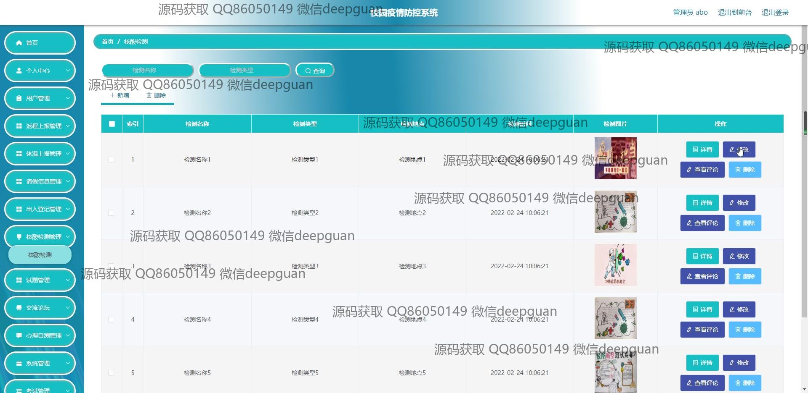

<h1 align="center">校园疫情防控系统</h1>

## 简介
校园疫情防控系统：角色分为管理员、用户；主要功能包括核酸检测、交流论坛、心理自测、疫情知识、个人信息管理、返程和体温上报、出入登记、请假信息管理、试题管理等，支持健康监测和疫情信息管理。    --计算机毕业设计源码；毕设源码；java毕业设计源码

## 联系方式

<h3 align="center">获取完整代码与数据库文件 + 微信：deepguan QQ: 86050149 QQ群: 783742310</h3>

<h3 align="center">可帮忙远程部署 包运行成功！提供远程部署、修改代码、设计文档指导、代码讲解等服务！</h3>

## 功能介绍（完整见运行截图）
管理员：支持用户管理、系统管理、返程上报、体温上报、请假信息管理、出入登记、核酸检测管理、心理自测管理及试题管理等功能，包括查看、审核和编辑多项疫情相关信息。管理员可通过后台管理系统进行网站设置及数据分析，帮助学校高效协调各项疫情防控任务，保证系统稳定运行及数据安全。

教职工：能够使用个人中心查看及更新个人信息，参与交流论坛获取和分享疫情信息，管理班级学生的体温及核酸检测结果，可查看心理自测报告和心理健康教育资源，帮助学生身心健康发展，同时支持审核学生返校申请和请假信息，维护校园秩序。

学生：注册成功后可登陆系统查看个人中心信息，进行体温上报、核酸检测结果查询、返程上报及健康码上传。学生还可通过心理自测模块进行自我心理健康评估，使用交流论坛与同学交流，浏览疫情知识模块增强防控意识。

访客：通过网站注册功能创建账户并进入系统，进行基本信息录入，浏览防控指南和交流论坛内容，了解校园疫情防控动态和政策，支持在首页查看核酸检测点安排及相关通知。

## 运行截图

本代码来源于网络,仅供学习参考使用!

